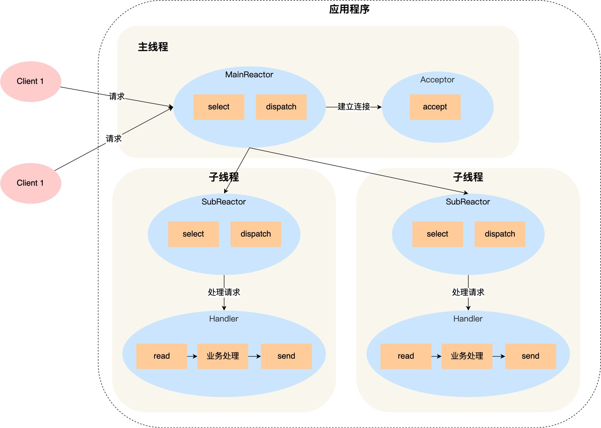
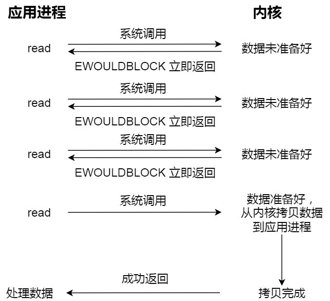
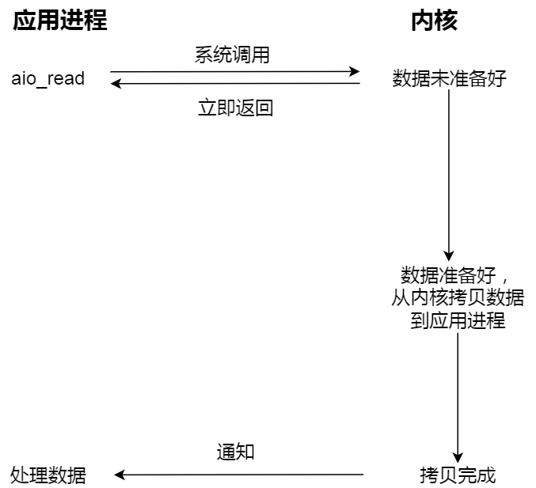
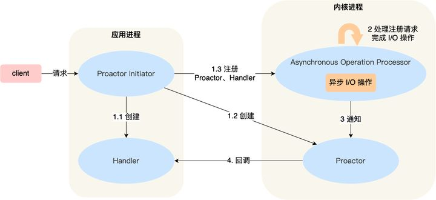

# reactor模型和proactor模型
reactor模型和procator模型，先简单介绍下这两种模型。
## reactor模型
reactor模型其实很很简单，原理就是采用的I/O多路复用，其中reactor对象负责监听I/O事件的产生和把事件分发出去，而事件处理器则负责相应的事件处理。比如acceptor处理器处理所有的accept事件，而接收/发送处理器处理所有的send/recv事件，你也可以把timer加进来，timer处理器处理所有的定时器事件。这里可以每个处理器一个线程，或者每个处理器一个进程。你的reactor也可以是运行在多个线程之上的，即每个epoll_wait就是一个reactor。从而变成高效的多reactor多进程/多线程方案。如下图所示：

Reactor 是非阻塞同步网络模式，感知的是就绪可读写事件。在每次感知到有事件发生（比如可读就绪事件）后，就需要应用进程主动调用 read 方法来完成数据的读取，也就是要应用进程主动将 socket 接收缓存中的数据读到应用进程内存中，这个过程是同步的，读取完数据后应用进程才能处理数据。
## proactor模型
proactor是异步网络模式。普通的非阻塞I/O比如read函数，在数据未准备好的时候，返回的是E_WOULDBLOCK，当数据准备好的时候，调用read读取，将数据从内核态拷贝到用户态。这不是真正的异步，真正的异步，指的是从内核态拷贝到用户态这一步，也不用阻塞在这里等待，而是使用通知的方式，也就是说当内核态到用户态拷贝完成的时候，通知用户，数据真正的已经获取到了。这算是真正的异步与普通的非阻塞I/O的区别。
如下图所示：

知乎上一个很形象生动的例子：
阻塞 I/O 好比，你去饭堂吃饭，但是饭堂的菜还没做好，然后你就一直在那里等啊等，等了好长一段时间终于等到饭堂阿姨把菜端了出来（数据准备的过程），但是你还得继续等阿姨把菜（内核空间）打到你的饭盒里（用户空间），经历完这两个过程，你才可以离开。
非阻塞 I/O 好比，你去了饭堂，问阿姨菜做好了没有，阿姨告诉你没，你就离开了，过几十分钟，你又来饭堂问阿姨，阿姨说做好了，于是阿姨帮你把菜打到你的饭盒里，这个过程你是得等待的。
异步 I/O 好比，你让饭堂阿姨将菜做好并把菜打到饭盒里后，把饭盒送到你面前，整个过程你都不需要任何等待。
asio使用的就是这个模型，即数据真正完成了读写后才通知。所以称之为异步网络模型。如下图所示：

Proactor 是异步网络模式， 感知的是已完成的读写事件。在发起异步读写请求时，需要传入数据缓冲区的地址（用来存放结果数据）等信息，这样系统内核才可以自动帮我们把数据的读写工作完成，这里的读写工作全程由操作系统来做，并不需要像 Reactor 那样还需要应用进程主动发起 read/write 来读写数据，操作系统完成读写工作后，就会通知应用进程直接处理数据。
## scheduler下使用的模型
遗憾的是，linux下的异步I/O支持不完善，aio系列函数是在用户空间下模拟出来的异步，而不是真正的操作系统级别的支持，并且还只支持本地文件的aio异步操作，网络socket行不通。。所以在linux下的高性能的网络库使用的是reactor模型，而不是proactor，在windows下则是可以使用这个效率更高的proactor模型。
## scheduler与reactor
在iocontext和scheduler那文中，我们知道scheduler其实就是多个线程从任务队列中取任务来执行的过程，当任务都被取完了，则运行完毕，会退出run函数，那么scheduler与reactor怎么绑定起来的呢，我们发现在scheduler的构造函数中，有个get_task_函数指针，该函数默认的就是scheduler的get_default_task函数。
### scheduler的get_default_task函数
get_default_task如函数所示，	如果未定义ASIO_HAS_IO_URING_AS_DEFAULT宏，将返回reactor的实例

	scheduler_task* scheduler::get_default_task(asio::execution_context& ctx)
	{
	#if defined(ASIO_HAS_IO_URING_AS_DEFAULT)
		return &use_service<io_uring_service>(ctx);
	#else // defined(ASIO_HAS_IO_URING_AS_DEFAULT)
		return &use_service<reactor>(ctx);
	#endif // defined(ASIO_HAS_IO_URING_AS_DEFAULT)
	}
### scheduler的init_task
可以看到，在init_task的时候，将会创建默认的后台任务，即上面的reactor

	void scheduler::init_task()
	{
		mutex::scoped_lock lock(mutex_);
		if (!shutdown_ && !task_)
		{
    		task_ = get_task_(this->context());
    		op_queue_.push(&task_operation_);
    		wake_one_thread_and_unlock(lock);
		}
	}
默认情况下，scheduler是不会调用init_task的，即默认的io_context/io_service是只有投递的任务，而没有默认的任务执行的。
先版本的io_service就是io_context。typedef了一下
### reactor的多种选择
当include reactor.hpp时，会根据宏的定义，来使用不同的api创建reactor模型

	#if defined(ASIO_HAS_IOCP) || defined(ASIO_WINDOWS_RUNTIME)
		typedef null_reactor reactor;
	#elif defined(ASIO_HAS_IO_URING_AS_DEFAULT)
		typedef null_reactor reactor;
	#elif defined(ASIO_HAS_EPOLL)
		typedef epoll_reactor reactor;
	#elif defined(ASIO_HAS_KQUEUE)
		typedef kqueue_reactor reactor;
	#elif defined(ASIO_HAS_DEV_POLL)
		typedef dev_poll_reactor reactor;
	#else
		typedef select_reactor reactor;
	#endif
因此在linux的平台下将会选择epoll_reactor。
因为scheduler的构造函数，就已经创建一个一个owner线程，它此时在等待被唤醒，而一旦被唤醒，执行的是scheduler的run函数。

	if (own_thread)
	{
    	++outstanding_work_;
    	asio::detail::signal_blocker sb;
    	thread_ = new asio::detail::thread(thread_function(this));
	}
thread_function(this)执行的就是this->run()，所以是scheduler的run函数，默认的own_thread是false。
### asio::ip::tcp::acceptor
我们拿tcp来分析下scheduler的reactor。

    asio::io_context ioc;
    asio::ip::tcp::acceptor acceptor(ioc, asio::ip::tcp::endpoint(asio::ip::tcp::v4(), 8000));
    acceptor.async_accept({});
    ioc.run();
acceptor的构造函数：

	template <typename ExecutionContext>
	basic_socket_acceptor(ExecutionContext& context,
      const endpoint_type& endpoint, bool reuse_addr = true,
      typename constraint<
        is_convertible<ExecutionContext&, execution_context&>::value
      >::type = 0)
    : impl_(0, 0, context)
	{
    	asio::error_code ec;
    	const protocol_type protocol = endpoint.protocol();
    	impl_.get_service().open(impl_.get_implementation(), protocol, ec);
    	asio::detail::throw_error(ec, "open");
    	if (reuse_addr)
    	{
      		impl_.get_service().set_option(impl_.get_implementation(),
          		socket_base::reuse_address(true), ec);
      		asio::detail::throw_error(ec, "set_option");
    	}
    	impl_.get_service().bind(impl_.get_implementation(), endpoint, ec);
    	asio::detail::throw_error(ec, "bind");
    	impl_.get_service().listen(impl_.get_implementation(),
        socket_base::max_listen_connections, ec);
    	asio::detail::throw_error(ec, "listen");
	}
其中open显然就是创建一个协议相关的socket了，然后可以对这个socket进行设置，上面的set_option是socket设置，比如常见的reuseaddr，接着是常规的绑定监听了。绑定监听后，就可以accept开始接收客户端的连接了。显然，impl_.get_service()返回的就是socket相关的封装类，可以对这个socket进行bind和listen。
#### 重要的listen参数
max_listen_connections是listen的队列值，这个值一定要设置成很大，不然你accept很容易被打满，从而许多连接被丢弃，之前我吃过亏，可以看到asio里的：

	  ASIO_STATIC_CONSTANT(int, max_listen_connections
      = ASIO_OS_DEF(SOMAXCONN));
这个SOMAXCONN非常大，是0x7fffffff，我们自己写的时候，也应该定义成最大。
#### impl_
impl_是关键，可见在不同平台下，impl_是选择相应的实现

	#if defined(ASIO_WINDOWS_RUNTIME)
	detail::io_object_impl<
    	detail::null_socket_service<Protocol>, Executor> impl_;
	#elif defined(ASIO_HAS_IOCP)
		detail::io_object_impl<
    		detail::win_iocp_socket_service<Protocol>, Executor> impl_;
	#elif defined(ASIO_HAS_IO_URING_AS_DEFAULT)
		detail::io_object_impl<
    		detail::io_uring_socket_service<Protocol>, Executor> impl_;
	#else
		detail::io_object_impl<
    		detail::reactive_socket_service<Protocol>, Executor> impl_;
	#endif
在linux下是最后的，即detail::reactive_socket_service

	(gdb) ptype impl_
	type = class asio::detail::io_object_impl<asio::detail::reactive_socket_service<asio::ip::tcp>, asio::any_io_executor>
可见impl_是一个io_object_impl，而每个io_object_impl有个service来提供数据，就是其模板的第一个参数，而acceptor的service就是reactive_socket_service，它继承自reactive_socket_service_base，而它有个reactor_成员，

	// The selector that performs event demultiplexing for the service.
	reactor& reactor_;
reactive_socket_service_base的构造函数：

	reactive_socket_service_base::reactive_socket_service_base(
		execution_context& context)
	: reactor_(use_service<reactor>(context))
	{
		reactor_.init_task();
	}
此时查看reactor_的类型，就是epoll_reactor

	(gdb) ptype reactor_
	type = class asio::detail::epoll_reactor
在use_service的函数调用中，进行了epoll_reactor类的创建，在init_task中，就调用了scheduler的init_task函数，初始化task_和task_operation_并push了一个task_operation_到任务队列op_queue_中。由于own_thread是false，task_interrupted_一开始创建的时候就是true，并且没有调用work_started，outstanding_work_也是0，所以此时执行run，依旧会退出。
#### async_accept
当acceptor提供了回调函数的时候，此时run就会进入阻塞，并一直运行下去，我们来分析下为什么：

	acceptor.async_accept({});
在这个函数内部，有这部分代码：
	
	template <
    ASIO_COMPLETION_TOKEN_FOR(void (asio::error_code,
       typename Protocol::socket::template rebind_executor<
         executor_type>::other)) MoveAcceptToken
          ASIO_DEFAULT_COMPLETION_TOKEN_TYPE(executor_type)>
	ASIO_INITFN_AUTO_RESULT_TYPE(MoveAcceptToken,
      void (asio::error_code,
        typename Protocol::socket::template
          rebind_executor<executor_type>::other))
	async_accept(
      ASIO_MOVE_ARG(MoveAcceptToken) token
        ASIO_DEFAULT_COMPLETION_TOKEN(executor_type))
	{
    	return async_initiate<MoveAcceptToken,
      		void (asio::error_code, typename Protocol::socket::template
        	rebind_executor<executor_type>::other)>(
          	initiate_async_move_accept(this), token,
          	impl_.get_executor(), static_cast<endpoint_type*>(0),
          	static_cast<typename Protocol::socket::template
            rebind_executor<executor_type>::other*>(0));
	}
最后走到的是self_->impl_.get_service().async_move_accept函数里，

	template <typename MoveAcceptHandler, typename Executor1, typename Socket>
    void operator()(ASIO_MOVE_ARG(MoveAcceptHandler) handler,
        const Executor1& peer_ex, endpoint_type* peer_endpoint, Socket*) const
    {
      // If you get an error on the following line it means that your handler
      // does not meet the documented type requirements for a MoveAcceptHandler.
      ASIO_MOVE_ACCEPT_HANDLER_CHECK(
          MoveAcceptHandler, handler, Socket) type_check;
      detail::non_const_lvalue<MoveAcceptHandler> handler2(handler);
      self_->impl_.get_service().async_move_accept(
          self_->impl_.get_implementation(), peer_ex, peer_endpoint,
          handler2.value, self_->impl_.get_executor());
    }
而通过上面我们知道self_->impl_.get_service()是reactive_socket_service，它有个reactor_，在linux就是epoll_reactor，不出意料的话是进入epoll_wait。在async_move_accept函数中，定义了一个op操作：

	typedef reactive_socket_move_accept_op<Protocol,PeerIoExecutor, Handler, IoExecutor> op;
    typename op::ptr p = { asio::detail::addressof(handler),
      op::ptr::allocate(handler), 0 };
    p.p = new (p.v) op(success_ec_, peer_io_ex, impl.socket_,
        impl.state_, impl.protocol_, peer_endpoint, handler, io_ex);
将其初始化后，进入开始accept阶段

	start_accept_op(impl, p.p, is_continuation, false);
而在accept函数中，

	void reactive_socket_service_base::start_accept_op(
    	reactive_socket_service_base::base_implementation_type& impl,
    	reactor_op* op, bool is_continuation, bool peer_is_open)
	{
		if (!peer_is_open)
			start_op(impl, reactor::read_op, op, is_continuation, true, false);
		else
		{
    		op->ec_ = asio::error::already_open;
    		reactor_.post_immediate_completion(op, is_continuation);
		}	
	}
可以看到，当peer_is_open为false的时候，就start_op，而当peer_is_open为true的时候，则使用post_immediate_completion向sheduler投递任务，op就是reactor_op的定义。上面传入的是false，所以调用的是start_op，有个参数是reactor::read_op，而reactor定义了这些op:

	enum op_types { read_op = 0, write_op = 1,
    	connect_op = 1, except_op = 2, max_ops = 3 };
我们都知道accept成功后表示数据可读，所以它是read_op，
	
	void reactive_socket_service_base::start_op(
    reactive_socket_service_base::base_implementation_type& impl,
    int op_type, reactor_op* op, bool is_continuation,
    bool is_non_blocking, bool noop)
	{
		if (!noop)
		{
    		if ((impl.state_ & socket_ops::non_blocking)
        		|| socket_ops::set_internal_non_blocking(
          		impl.socket_, impl.state_, true, op->ec_))
    		{
      			reactor_.start_op(op_type, impl.socket_,
          			impl.reactor_data_, op, is_continuation, is_non_blocking);
      			return;
    		}
		}
		reactor_.post_immediate_completion(op, is_continuation);
	}
noop为false表示有op，所以会走reactor_.start_op即epoll_reactor的start_op。
这个函数相当长，在epoll_reactor.ipp的第232行。我们这里只看下它的行为，上面的impl.reactor_data_是epoll_reactor::per_descriptor_data类型，

	class descriptor_state : operation
	{
    	friend class epoll_reactor;
    	friend class object_pool_access;
    	descriptor_state* next_;
    	descriptor_state* prev_;
    	mutex mutex_;
    	epoll_reactor* reactor_;
    	int descriptor_;
    	uint32_t registered_events_;
    	op_queue<reactor_op> op_queue_[max_ops];
    	bool try_speculative_[max_ops];
    	bool shutdown_;
    	ASIO_DECL descriptor_state(bool locking);
    	void set_ready_events(uint32_t events) { task_result_ = events; }
    	void add_ready_events(uint32_t events) { task_result_ |= events; }
    	ASIO_DECL operation* perform_io(uint32_t events);
    	ASIO_DECL static void do_complete(
        	void* owner, operation* base,
        	const asio::error_code& ec, std::size_t bytes_transferred);
	};
这个描述符有mutex锁，而start_op也确实会先上锁，因为每个reactive_socket_service是会有一个reactor_data_，上面的op_queue是一个操作完成的队列，它是个数组，因为有多种操作，如read，write。表示当前的操作队列，最典型的就是当发送数据时，如果write此时繁忙，就需要设置epollout事件，这个函数也确实这么做了：

      if (op_type == write_op)
      {
        if ((descriptor_data->registered_events_ & EPOLLOUT) == 0)
        {
          epoll_event ev = { 0, { 0 } };
          ev.events = descriptor_data->registered_events_ | EPOLLOUT;
          ev.data.ptr = descriptor_data;
          if (epoll_ctl(epoll_fd_, EPOLL_CTL_MOD, descriptor, &ev) == 0)
          {
            descriptor_data->registered_events_ |= ev.events;
          }
          else
          {
            op->ec_ = asio::error_code(errno,
                asio::error::get_system_category());
            scheduler_.post_immediate_completion(op, is_continuation);
            return;
          }
        }
      }
最后执行

	descriptor_data->op_queue_[op_type].push(op);
	scheduler_.work_started();
可以看到调用了work_started，所以outstanding_work就为1了，所以在run的时候，就会do_run_one，会运行default_task，即下面这段：

      if (o == &task_operation_)
      {
        task_interrupted_ = more_handlers;
        if (more_handlers && !one_thread_)
          wakeup_event_.unlock_and_signal_one(lock);
        else
          lock.unlock();
        task_cleanup on_exit = { this, &lock, &this_thread };
        (void)on_exit;
        // Run the task. May throw an exception. Only block if the operation
        // queue is empty and we're not polling, otherwise we want to return
        // as soon as possible.
        task_->run(more_handlers ? 0 : -1, this_thread.private_op_queue);
      }
task_->run进入的就是epoll_reactor的run函数了。

	void epoll_reactor::run(long usec, op_queue<operation>& ops)
	{
	// This code relies on the fact that the scheduler queues the reactor task
	// behind all descriptor operations generated by this function. This means,
	// that by the time we reach this point, any previously returned descriptor
	// operations have already been dequeued. Therefore it is now safe for us to
	// reuse and return them for the scheduler to queue again.
	// Calculate timeout. Check the timer queues only if timerfd is not in use.
	int timeout;
	if (usec == 0)
    	timeout = 0;
	else
	{
    	timeout = (usec < 0) ? -1 : ((usec - 1) / 1000 + 1);
    	if (timer_fd_ == -1)
    	{
      		mutex::scoped_lock lock(mutex_);
      		timeout = get_timeout(timeout);
    	}
	}
	// Block on the epoll descriptor.
	epoll_event events[128];
	int num_events = epoll_wait(epoll_fd_, events, 128, timeout);
可以看到，此时进入了epoll_wait，从而进入等待事件的状态。
### epoll_reactor的具体分析，我们留到下一章节。从info threads来看，只有一个主线程在跑，所以它的reactor模型是单线程的reactor模型。

